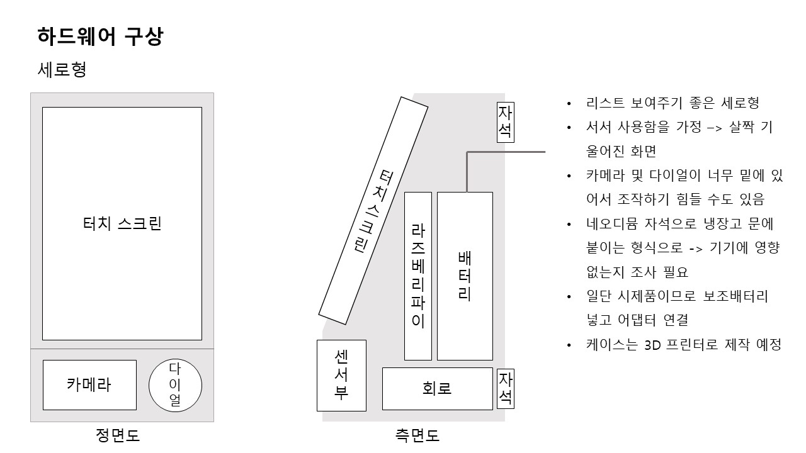
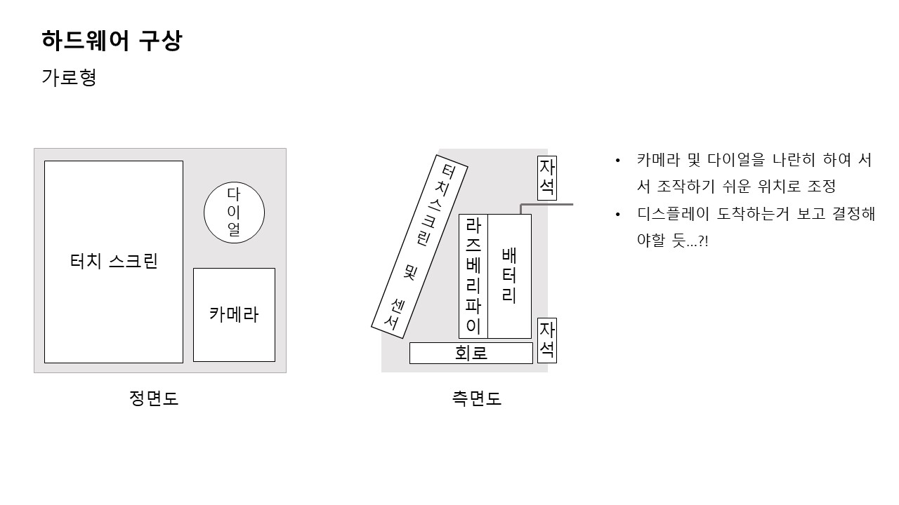

# 냉장고를 부탁해(가제) - Device
> 냉장고를 부탁해(가제)의 디바이스 측 소스코드

## 목차
- [디바이스 개요](#디바이스-개요)
- [디바이스 구조](#디바이스-구조)
- [GUI 설계](#GUI-설계)
- [폴더 구조](#폴더-구조)

## 디바이스 개요

## 디바이스 구조
### 세로형

### 가로형

## GUI 설계
### 자료 분석 및 와이어 프레임
첨부 자료 참고
[GUI 와이어 프레임](./참고자료/기존 어플리케이션 분석 및 GUI 흐름도.pdf)

## 폴더구조